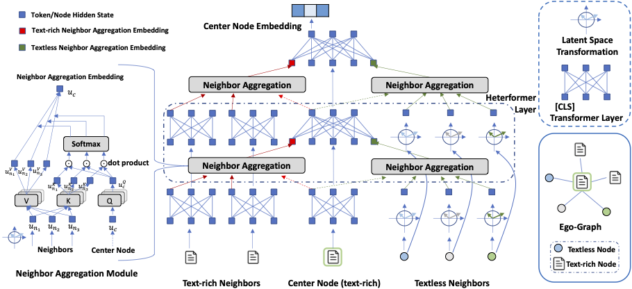

# Heterformer

This repository contains the source code and datasets for [Heterformer: Transformer-based Deep Node Representation Learning on Heterogeneous Text-Rich Networks](https://arxiv.org/abs/2205.10282), published in KDD 2023.

## Links

- [Requirements](#requirements)
- [Overview](#overview)
- [Data](#data)
- [Train](#train)
- [Inference](#inference)
- [Downstream Tasks](#downstream)
- [Citations](#citations)

## Requirements

The code is written in Python 3.6. Before running, you need to first install the required packages by typing following commands (Using a virtual environment is recommended):

```
pip3 install -r requirements.txt
```

## Overview
**Heterformer** is a Transformer architecture (language model) for representation on heterogeneous text-rich (text-attributed) networks. It can take text data associated with nodes and heterogeneous network structure information into consideration.

<p align="center">
  
</p>

## Data
1. Download raw data from [DBLP](https://originalstatic.aminer.cn/misc/dblp.v12.7z), [Twitter](https://drive.google.com/file/d/0Byrzhr4bOatCRHdmRVZ1YVZqSzA/view?resourcekey=0-3_R5EWrLYjaVuysxPTqe5A) and [Goodreads](https://sites.google.com/eng.ucsd.edu/ucsdbookgraph/home).
2. Data processing: Run the cells in data/$dataset/data_processing.ipynb for first step data processing.
3. Network Sampling: Run the cells in data/$dataset/sampling.ipynb for ego-network sampling and train/val/test data generation.
4. Pretrain data: Run the cells in data/$dataset/generate_pretrain_data.ipynb for textless node pretraining data generation.

## Train
1. Pretrain textless node embeddings.
Take Goodreads dataset as an example.
```
cd pretrain/
bash run.sh
```

2. Prepare textless node embedding file for Heterformer training.

Run the cells in pretrain/transfer_embed.ipynb

3. Heterformer training.
```
cd ..
python main.py --data_path data/$dataset --model_type Heterformer --pretrain_embed True --pretrain_dir data/$dataset/pretrain_embed
```

## Test
```
python main.py --data_path data/$dataset --model_type Heterformer --mode test --load_ckpt_name $load_ckpt_dir
```

## Inference
```
python main.py --data_path data/$dataset --model_type Heterformer --mode infer --load 1 --load_ckpt_name $load_ckpt_dir
```

## Downstream
#### Transductive Text-rich node classification
```
cd downstream/
python classification.py --mode transductive --dataset $dataset --method Heterformer
```

#### Inductive Text-rich node classification
```
python classification.py --mode inductive --dataset $dataset --method Heterformer
```

#### Textless node classification
```
python author_classification.py --dataset $dataset --method Heterformer
```

#### Node Clustering
```
python clustering.py --mode transductive --dataset $dataset --method Heterformer
```

#### Retrieval
```
python retrieval.py --method Heterformer
```

## Citations

Please cite the following paper if you find the code helpful for your research.
```
@inproceedings{jin2023heterformer,
  title={Heterformer: Transformer-based deep node representation learning on heterogeneous text-rich networks},
  author={Jin, Bowen and Zhang, Yu and Zhu, Qi and Han, Jiawei},
  booktitle={Proceedings of the 29th ACM SIGKDD Conference on Knowledge Discovery and Data Mining},
  pages={1020--1031},
  year={2023}
}
```
